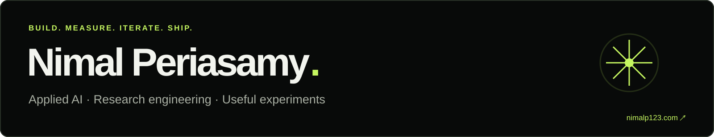

**[Website ↗](https://nimalp123.com/)** · **[LinkedIn ↗](https://www.linkedin.com/in/nimal-periasamy/)** · **[Rayaboy ↗](https://rayaboy.com)**

I'm Nimal. I build applied AI products, research systems, and experiments that turn into useful things.

### Building at Rayaboy

- **Product:** SuperProfile, document → profile, writing, review, and export.
- **Applied AI:** browser research, document intelligence, and evidence verification.
- **Research infrastructure:** controlled experiments, isolated workers, model-free source capture, and restartable runs.

**My loop:** hypothesis → build → independent frontier-model review → verifiable tests → iterate.

`FIXED INPUTS` · `VERSIONED ARTIFACTS` · `HELD-OUT EVALUATIONS` · `FAILURES → REGRESSIONS`

### My work / the receipts

<strong>Behind the numbers ↗</strong>

| Result | What I built and measured |
| :--- | :--- |
| **3.3×** observed batch throughput | Parallel execution: 93 → 28 minutes on the same six real development pages; same terminal outcomes. |
| **78%** fewer invalid AI proposals | Iterated one experimental arm: 45 → 10 on an unchanged 12-case synthetic benchmark. |
| **83%** fewer output tokens | 963k → 163k in a controlled 12-case baseline/tuned-arm comparison. |
| **22%** shorter evaluation runtime | 64 → 50 minutes in that baseline/tuned-arm comparison. |
| **6 → 11 / 12** exact matches | Initial/final runs, same arm and synthetic fixtures. |
| **12 / 12** passed verification | Up from 10/12 on the same synthetic benchmark. |
| **20/20** repeated document trials | 470/470 required fields matched on an already-seen synthetic validation set. |
| **539 / 539** selected course cells exact | 77/77 rows, each of two trials on one real development template. |
| **9,600** passing unit checks | September 30 scraper development checkpoint; 347 skipped. |
| **137** regression cases | Document-pipeline corrections turned independent review findings into verifiable checks. |

<strong>More from the lab ↗</strong>

| Checkpoint | Recorded result |
| :--- | :--- |
| Document research | **231** tracked model calls across PR55 development, comparison, and validation |
| Offline source checks | **3,289** passed: 1,834 backend/core + 1,455 app |
| Controlled response fixtures | **299**, exercised by 151 focused tests, including rejection cases |
| Frozen replay probes | **167**; **79/79** legacy outputs unchanged |
| Labeled-condition retention | **98.8%**: 251/254 reference-recorded labels present in model-free captures; same 97 development cases |
| Start-page agreement | **98.7%**: 78/79 start comparisons matched between model-free and reference recordings |
| Discovery research | **86** entries with readable real-web captures |
| Saved source readings | **133**: 117 HTML + 16 PDF texts |
| Research corpus | **19,977** source units cataloged for evaluation |
| Artifact validation | **95/97** recordings admitted in the original campaign; two failures retained |
| Browser isolation | **0** leaked processes across three repeated crash/cancel/deadline test cycles |

Recorded September 2026 development experiments and engineering checkpoints. Each result keeps its test scope; the figures describe separate runs and overlapping suites. [Measurement notes ↗](RESEARCH-SNAPSHOTS.md)

**Rayaboy itself:** **100** registered accounts · **40+** catalog scholarships · **$336k** listed scholarship funding.

September 29, 2026 snapshots. Accounts include admin, unverified, and retained test registrations. Funding is listed value. [Live registration counter ↗](https://nimalp123.com/#rayaboy)

### See Rayaboy in action

**[CLICK THE PREVIEW OR OPEN RAYABOY.COM ↗](https://rayaboy.com)**

### The public experiment

**[Instagram Friendship Graph ↗](https://github.com/nimalp123/instagram-friendship-graph)** — my completed mapping experiment: Instagram connections turned into an explorable Obsidian vault.

**5,347** anonymous accounts · **5,992** observed mutual-follow links · **3°** of connection.

Next questions: who might I click with, which mutuals connect us, and what could this data help me discover? The map is finished; the analysis is still ahead.

September 2026 snapshot. Second and third degree totals are observed lower bounds.

[Explore the repo ↗](https://github.com/nimalp123/instagram-friendship-graph) · [Try the interactive graph ↗](https://nimalp123.com/#work)

---

`03 / THE PUBLIC ARCHIVE`

## A few builds. More questions.

| Aura order | Project | The experiment |
| :--- | :--- | :--- |
| **01** | [Instagram Friendship Graph ↗](https://github.com/nimalp123/instagram-friendship-graph) | A completed graph. More analysis to explore. |
| **02** | [Trading algorithms ↗](https://github.com/nimalp123/tradingAlgos) | Trading programs and stock-data analysis. |
| **03** | [FoodConnect ↗](https://github.com/nimalp123/FoodConnect) | An early Python build. |
| **04** | [Mediquery ↗](https://github.com/nimalp123/mediquery) | An early Python experiment. |

Ordered by aura. Completely subjective. Completely intentional.

---

**Working on a hard problem? [Find me on LinkedIn ↗](https://www.linkedin.com/in/nimal-periasamy/)** · **[See the work ↗](https://nimalp123.com/)**
